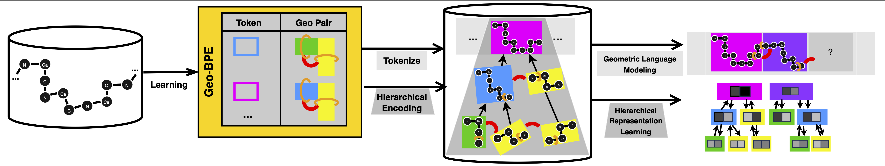

# Protein Geometric Byte Pair Encoding

## Installation

```bash
conda env create -f environment.yml
conda activate GeoBPE
pip install esm==3.2.0 --no-deps # install ESM
pip install -e ./  # make sure ./ is the root
```

## Downloading data

The RCSB PDB pretraining dataset and CAMEO/CASP test data should be placed under `data/vqvae_pretrain/{train|validation|CAMEO|CASP14}`. For train/validation, we include only a few .pdb files for smoke testing (download the rest through official channels).

The processed task-specific splits are given as .jsonl files under data/struct_token_bench. To download the PDB structures:
```bash
cd data/struct_token_bench

source=InterProFunctionDataset
ds=(binding activesite conservedsite repeat)
for $d in "${ds[@]}"; do for f in "${source}_{$d}*.jsonl"; do python download_pdbs.py --data_file $f --output_dir "interpro/$d$"; done; done

source=BioLIP2FunctionDataset
ds=(binding catalytic)
for $d in "${ds[@]}"; do for f in "${source}_{$d}*.jsonl"; do python download_pdbs.py --data_file $f --output_dir "biolip2/$d$"; done; done

source=ProteinGLUEEpitopeRegionDataset
for f in "${source}*.jsonl"; do python download_pdbs.py --data_file $f --output_dir "proteinglue"; done

source=ProteinShakeBindingSiteDataset
for f in "${source}*.jsonl"; do python download_pdbs.py --data_file $f --output_dir "proteinshake"; done

source=TapeRemoteHomologyDataset
for f in "${source}*.jsonl"; do python download_pdbs.py --data_file $f --output_dir "homo"; done
```

## Run GeoBPE

### Learn tokenizer with PDB pretrain train set

```bash
# go to repo root
./scripts/encode.sh 0 300 100 1 pretrain '1-500' histogram 5 5 false 0 2-100:3-500:5-20:6-100:8-5:9-20:11-1:12-5:14-1 5000 false 1.0 all true true 10 10000 # slurm ready; prepend sbatch settings if using
```

Each run creates a folder `ckpts/$d` (e.g. `ckpts/1763070917.6459317`) containing periodic tokenizer checkpoints (`bpe_iter=$iter.pkl`), visualizations, and metrics. You can monitor the running statistics (files matching `*=$iter*`) and stop when desired vocabulary size / token size / segmentation lengths is hit. A suggested stopping iteration (based on LLM scaling heuristic) is marked in `run_iter=$iter.png`.

### Encode validation set (PDB), test sets (CAMEO, CASP) and analyze the token efficiency.

Once you set `d`
```bash
./scripts/induce.sh 0 0 {prevalid|cameo|casp} ckpts/$d/bpe_post_init.pkl false
```

Each run creates another folder `ckpts/$dval` and the tokenized structures are stored in `ckpts/$dval/$i.pkl`. They are appended to the train set (`ckpts/$d/bpe_post_init.pkl`) and written to `ckpts/$dval/bpe_iter=$iter.pkl`.

### Encode Task-Specific Dataset with Tokenizer at Iteration $iter.

```bash
./scripts/induce.sh 0 0 {bindint|bindbio|catint|catbio|conserved|repeat|ept|atlas|bindshake|homo} ckpts/$d/bpe_iter=$iter.pkl false
```

Each run creates another folder `ckpts/$dtask` and the tokenized structures are stored in `ckpts/$dtask/$i.pkl`. They are concatenated and saved in `ckpts/$dtask/bpe_iter=$iter.pkl`.

### Downstream Transfer Prediction Tasks

```bash
./scripts/predict.sh 0 {1|2|..|10} ckpts/$dtask/bpe_iter=$iter.pkl
```

### Small Structure Language Model (SSLM) Evaluation

Make sure prevalid is encoded first (command above).

```bash
./scripts/train.sh 0 0 {bindint|bindbio|catint|catbio|conserved|repeat|ept|atlas|bindshake|homo} ckpts/$dval/bpe_iter=$iter.pkl false
```

### Run VQ-VAE baselines (with our SSLM eval loop)

We extend the benchmarking codebase from Yuan et al. (ICML 2025). More details are found on their [public released codebase](https://github.com/KatarinaYuan/StructTokenBench). Follow their steps or run the following to create a env called ``pstbench''.

Pretrain the VQ-VAE with periodic SSLM eval.

```bash
cd StructTokenBench
conda env create -f environment.yml
conda activate pstbench
./pretrain.sh 0 512 0 {vanillavq|aminoaseed}
```
