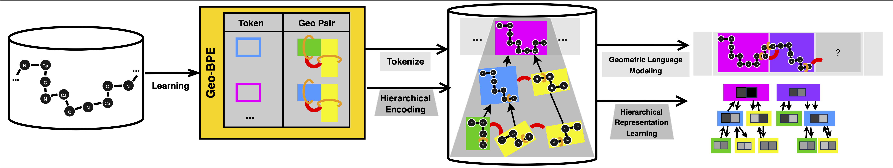
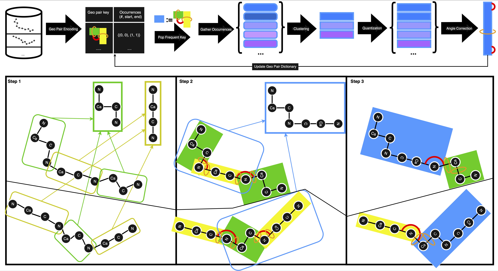

# Protein Geometric Byte Pair Encoding
[](https://pypi.org/project/GeoBPE/0.1.0/)
[](https://arxiv.org/abs/2511.11758)
[](https://openreview.net/forum?id=55e5f3GVFc)



This repo contains our implementation of Protein Structure Tokenization via Geometric Byte Pair Encoding (ICLR 2026).

## Overview

Protein structure is central to biological function, and enabling multimodal protein models requires joint reasoning over sequence, structure, and function. We introduce GeoBPE, a geometry-grounded PST that transforms continuous, noisy, multi-scale backbone conformations into discrete ``sentences" of geometry while enforcing global constraints.

Analogous to byte-pair encoding, GeoBPE generates a hierarchical vocabulary of geometric primitives by iteratively (i) clustering Geo-Pair occurrences with k-medoids to yield a resolution-controllable vocabulary; (ii) quantizing each Geo-Pair to its closest medoid prototype; and (iii) reducing drift through differentiable inverse kinematics that optimizes boundary glue angles under an SE(3) end-frame loss.



GeoBPE offers **compression** (>10x reduction in bits-per-residue at similar distortion rate), **data efficiency** (>10x less training data), and **generalization** (maintains test/train distortion ratio of 1.0−1.1). It is architecture-agnostic: (a) its hierarchical vocabulary provides a **strong inductive bias** for coarsening residue-level embeddings from large PLMs into motif- and protein-level representations, **consistently outperforming leading PSTs** across 12 tasks and 24 test splits; (b) paired with a transformer, GeoBPE supports **unconditional backbone generation via language modeling**; and (c) tokens align with CATH functional families and **support expert-interpretable case studies**, offering functional meaning absent in prior PSTs.

## Installation

```bash
conda env create -f environment.yml
conda activate GeoBPE
pip install esm==3.2.0 --no-deps # install ESM
pip install -e ./  # make sure ./ is the root
```

## Downloading data

The RCSB PDB pretraining dataset and CAMEO/CASP test data should be placed under `data/vqvae_pretrain/{train|validation|CAMEO|CASP14}`. For train/validation, we include only a few .pdb files for smoke testing (download the rest through official channels).

The processed task-specific splits are given as .jsonl files under data/struct_token_bench. To download the PDB structures:
```bash
cd data/struct_token_bench

source=InterProFunctionDataset
ds=(binding activesite conservedsite repeat)
for d in "${ds[@]}"; do for f in ${source}_${d}*.jsonl; do python download_pdbs.py --data_file "$f" --output_dir "interpro/$d"; done; done

source=BioLIP2FunctionDataset
ds=(binding catalytic)
for d in "${ds[@]}"; do for f in ${source}_${d}*.jsonl; do python download_pdbs.py --data_file "$f" --output_dir "biolip2/$d"; done; done

source=ProteinGLUEEpitopeRegionDataset
for f in ${source}*.jsonl; do python download_pdbs.py --data_file "$f" --output_dir "proteinglue"; done

source=ProteinShakeBindingSiteDataset
for f in ${source}*.jsonl; do python download_pdbs.py --data_file "$f" --output_dir "proteinshake"; done

source=TapeRemoteHomologyDataset
for f in ${source}*.jsonl; do python download_pdbs.py --data_file "$f" --output_dir "homo"; done
```
For a quick smoke test, use `proteinglue` (ept).

## Run GeoBPE

We include the following resources to make it easy to use GeoBPE:
- **GeoBPE API and Usage Guidelines Doc** ([./docs/hparam_guide.md](./docs/hparam_guide.md)) -- descriptions, intuitions, and guidelines on how to effectively and efficiently use GeoBPE
- **Experiment Logs** ([./docs/GeoBPE-logged-runs.pdf](./docs/GeoBPE-logged-runs.pdf)) -- collection of past experiments varying hyperparameters settings; quickly lookup settings & performance to save future iteration time.

### Learn tokenizer with PDB pretrain train set

```bash
# suggested setting for downstream transfer experiments
./scripts/encode.sh 0 0 3 3 pretrain '1-50' histogram 5 5 false 0 2-2:3-5:5-1:6-2:8-1 500 true 0.0 all true true 10 1000 # slurm ready; prepend sbatch settings if using

# suggested setting for pareto-optimal compression-reconstruction
./scripts/encode.sh 0 0 3 3 pretrain '1-500' histogram 5 5 false 0 2-100:3-500:5-20:6-100:8-5:9-20:11-1:12-5:14-1 500 true 1.0 all true true 1 0
```

Each run creates a folder `ckpts/$d` (e.g. `ckpts/1763070917.6459317`) containing periodic tokenizer checkpoints (`bpe_iter=$iter.pkl`), visualizations, and metrics. You can monitor the running statistics (files matching `*=$iter*`) and stop when desired vocabulary size / token size / segmentation lengths is hit. A suggested stopping iteration (based on LLM scaling heuristic, see [./docs/lm-heuristic.png](./docs/lm-heuristic.png)) is marked in `run_iter=$iter.png`.

### Encode validation set (PDB), test sets (CAMEO, CASP) and analyze the token efficiency.

Once you set `d`
```bash
./scripts/induce.sh 0 0 {prevalid|cameo|casp} ckpts/$d/bpe_post_init.pkl false
```

Each run creates another folder `ckpts/$dval` and the tokenized structures are stored in `ckpts/$dval/$i.pkl`. They are appended to the train set (`ckpts/$d/bpe_post_init.pkl`) and written to `ckpts/$dval/bpe_iter=$iter.pkl`.

### Encode Task-Specific Dataset with Tokenizer at Iteration $iter.

After downloading the structures, run:
```bash
./scripts/induce.sh 0 0 {bindint|bindbio|catint|catbio|conserved|repeat|ept|atlas|bindshake|homo} ckpts/$d/bpe_iter=$iter.pkl false
```

Each run creates another folder `ckpts/$dtask` and the tokenized structures are stored in `ckpts/$dtask/$i.pkl`. They are concatenated and saved in `ckpts/$dtask/bpe_iter=$iter.pkl`.

### Downstream Transfer Prediction Tasks

Tasks 1, 2, ..., 10 correspond to the order above (1 for bindint, ..., 10 for homo). Make sure the dataset is encoded first.
```bash
./scripts/predict.sh 0 {1|2|..|10} ckpts/$dtask/bpe_iter=$iter.pkl
```

### Small Structure Language Model (SSLM) Evaluation

Make sure prevalid is encoded first (command above).

Train a small LM (adapt hyperparams as necessary):
```bash
./scripts/train.sh 0 8 0 ckpts/$dval/bpe_post_init.pkl
```

Pick the latest best ckpt. Sample and compute generative metrics:
```bash
./scripts/train.sh 0 8 0 ckpts/$dval/bpe_post_init.pkl ckpts/$dval/ckpt_epoch${epoch}.pt 1 # this samples 1 backbone, change to as many as you like
```

### Run VQ-VAE baselines (with our SSLM eval loop)

We extend the benchmarking codebase from Yuan et al. (ICML 2025). More details are found on their [public released codebase](https://github.com/KatarinaYuan/StructTokenBench). Follow their steps or run the following to create a env called ``pstbench''.

Pretrain the VQ-VAE with periodic SSLM eval.

```bash
cd StructTokenBench
conda env create -f environment.yml
conda activate pstbench
./pretrain.sh 0 512 0 {vanillavq|aminoaseed}
```

## Citation
If you use GeoBPE in your research, please cite our paper:
```
@inproceedings{sun2025protein,
  title={Protein Structure Tokenization via Geometric Byte Pair Encoding},
  author={Sun, Michael and Yuan, Weize and Liu, Gang and Matusik, Wojciech and Zitnik, Marinka},
  booktitle={International Conference on Learning Representations},
  year={2026},
  url={https://arxiv.org/abs/2511.11758}
}
```

## Contact

Please contact msun415@mit.edu if you have any questions.